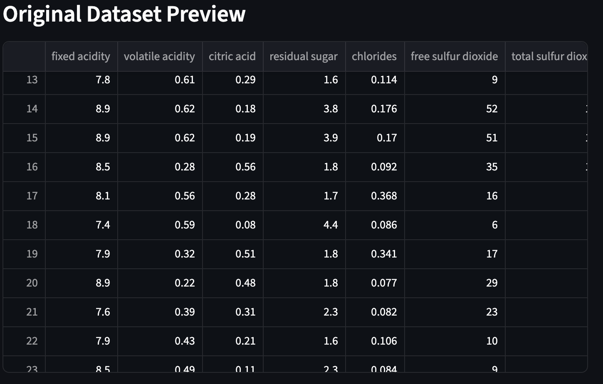
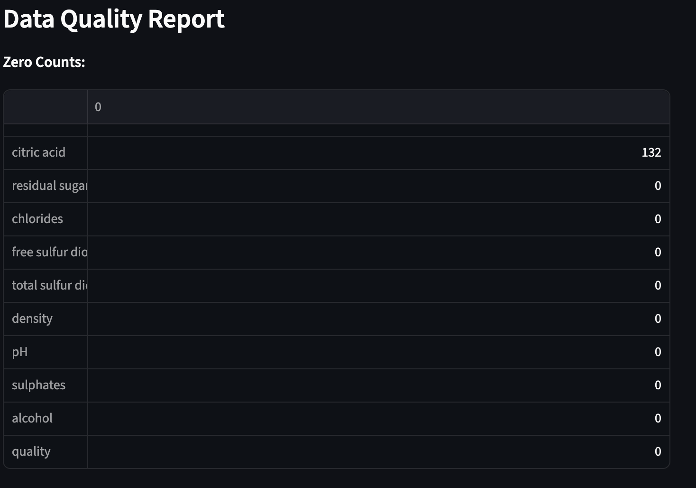
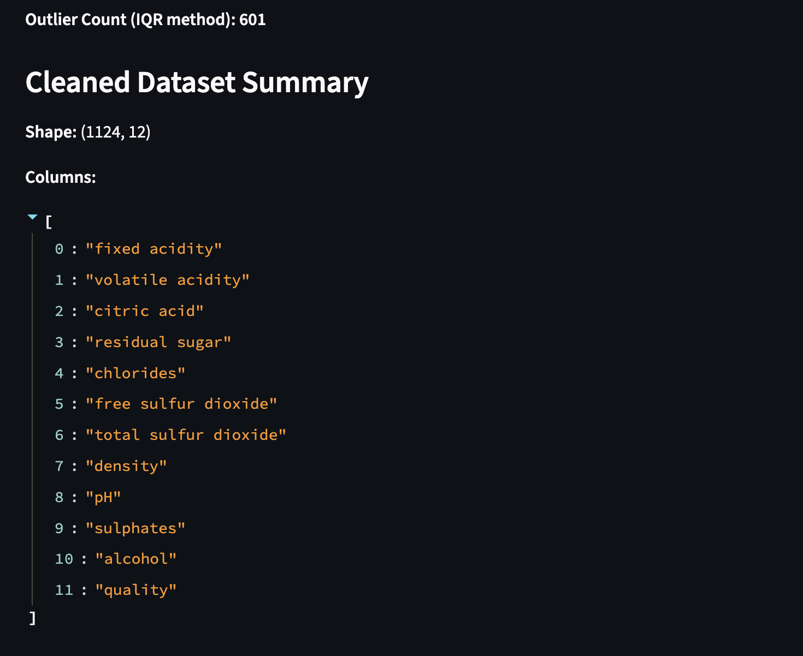
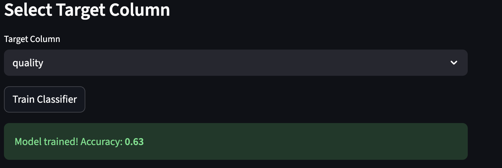
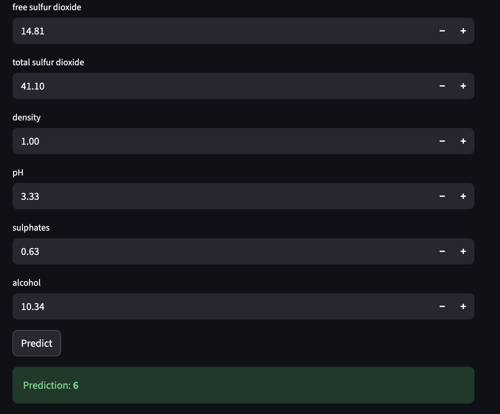

#  **Streamlit Classification App**

##  Overview

This Streamlit application provides an end-to-end workflow for **building a simple machine-learning classification model** using any uploaded CSV dataset. It includes:

* Data upload
* Data validation (zeros, nulls, outliers)
* Automatic cleaning
* Dataset summary
* Target column selection
* Classifier training
* Accuracy display
* Interactive prediction UI

The goal is to give users an intuitive, visual interface for preparing data and training a basic classifier without writing code.

---

##  **How to Run**

Install dependencies:

```bash
pip install streamlit pandas scikit-learn numpy
```

Run the app:

```bash
streamlit run app.py
```

---

#  **Code Structure & UI Explanation**


---

#  **Title Section**

```python
st.title(" Classifier")
```

---

#  **Dataset Upload Section**

```python
uploaded_file = st.file_uploader("Upload Classification Dataset", type=["csv"])
```


### UI Behavior:

After upload, the data is immediately displayed as a preview for verification.

---

#  **Data Preview**

```python
df = pd.read_csv(uploaded_file)
st.subheader(" Original Dataset Preview")
st.dataframe(df)
```

* Shows the original dataset before any cleaning
* Lets the user confirm the dataset loaded correctly

---

# **Data Quality Report**

```python
zero_counts = (df == 0).sum()
null_counts = df.isnull().sum()
```

Columns where zeros appear, which may indicate invalid measurements (e.g., pH = 0).

Columns with missing values.

Both results are displayed to the user:

```python
st.write("**Zero Counts:**")
st.write(zero_counts)

st.write("**Null Counts:**")
st.write(null_counts)
```

---

# **Automatic Cleaning**

###  Drop null rows

```python
df = df.dropna()
```

###  Outlier detection using IQR

For numerical columns:

* Calculate Q1 and Q3
* Compute Inter-Quartile Range (IQR)
* Determine out-of-bound values
* Count and remove them

```python
numeric_cols = df.select_dtypes(include=[np.number]).columns
```

The app displays:

```
Outlier Count (IQR method): XXX
```

Outliers can:

* Distort model performance
* Skew statistics
* Harm classification accuracy

This app removes them automatically to deliver a healthier dataset.

---

#  **Cleaned Dataset Summary**

```python
st.write(f"**Shape:** {df.shape}")
st.write("**Columns:**", list(df.columns))
```

* Number of rows after cleaning
* Number of columns
* Column names
---

#  **Target Column Selection**

```python
target = st.selectbox("Target Column", df.columns)
```

The target column is the variable the classifier will learn to predict.

Example:

* “quality”
* “label”
* “class”
* “outcome”

---

#  **Classifier Training**

```python
model = LogisticRegression(max_iter=500)
model.fit(X_train, y_train)
```

* The dataset is split into **training** and **testing** subsets
* A **Logistic Regression classifier** is trained
* Predictions are generated and evaluated

###  Accuracy Display:

```python
st.success(f" Model trained! Accuracy: **{acc:.2f}**")
```

The model and feature list are saved inside:

```python
st.session_state["model"]
st.session_state["features"]
```

This allows the app to use the trained model later for prediction.

---

#  **Prediction Interface**

```python
for feature in st.session_state["features"]:
    val = st.number_input(f"{feature}", value=float(df[feature].mean()))
```

A simple form where they manually enter numeric values for each feature.

This allows users to quickly test predictions without entering everything manually.

### Prediction Button

```python
pred = st.session_state["model"].predict(values)[0]
st.success(f" Prediction: **{pred}**")
```

Outputs the predicted class for the entered values.

---
