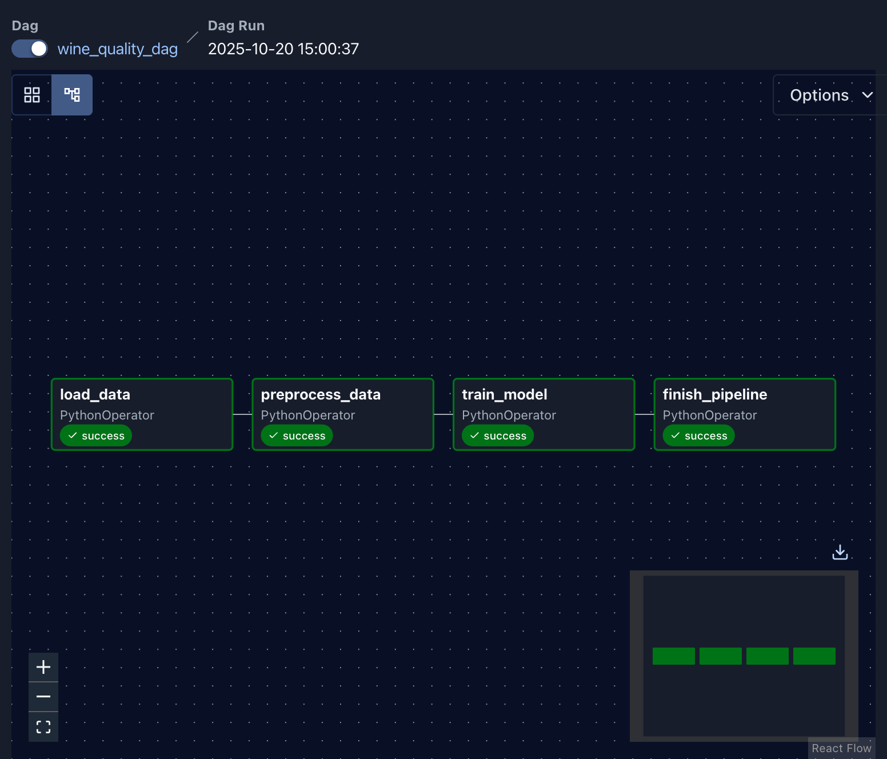
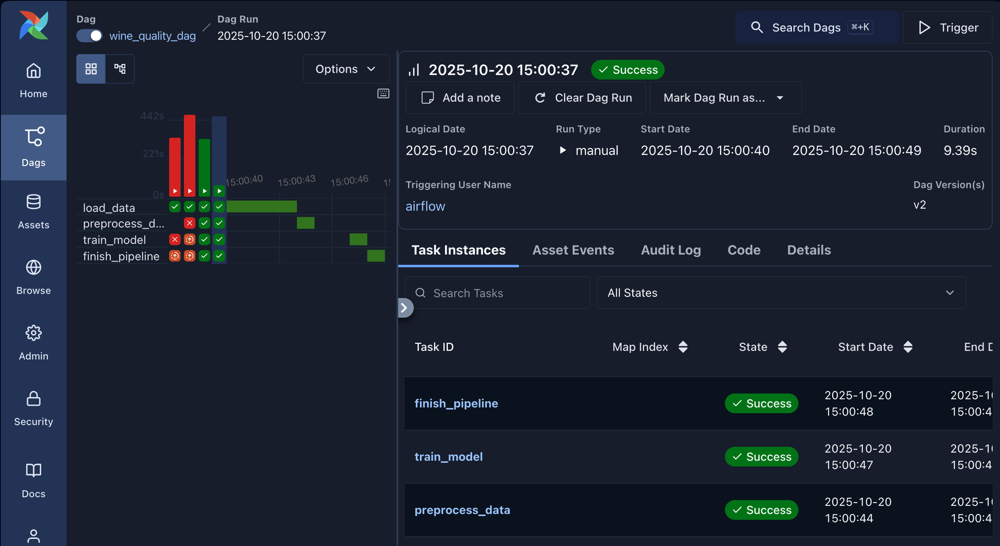

# Airflow lab

- In order to install Airflow using docker you can watch our [Airflow Lab1 Tutorial Video](https://youtu.be/exFSeGUbn4Q?feature=shared)
- For latest step-by-step instructions, check out this blog - [AirFlow Lab-1](https://www.mlwithramin.com/blog/airflow-lab1)

### ML Model

This script is designed for data clustering using K-Means clustering and determining the optimal number of clusters using the elbow method. It provides functionality to load data from a CSV file, perform data preprocessing, build and save a K-Means clustering model, and determine the number of clusters based on the elbow method.

#### Prerequisites

Before using this script, make sure you have the following libraries installed:

- pandas
- scikit-learn (sklearn)
- kneed
- pickle
- numpy
- joblib
- apache-airflow

#### Usage

You can use this script to perform K-Means clustering on your dataset as follows:

```python
"""
Step-by-step workflow for Wine Quality Prediction

"""

from src.wine_pipeline import load_data, preprocess_data, train_model, finish_pipeline

# Load and clean the dataset
raw_data = load_data()

# Preprocess the data

preprocessed_data = preprocess_data(ti=None)  

# Train the regression model
train_model(ti=None)

# Finish and summarize the workflow
finish_pipeline(ti=None)

```

#### Functions

1. **load_data():**
   - Loads the Wine Quality dataset (winequality-red.csv), cleans the column names (handles semicolons and spaces), and logs dataset statistics such as shape, missing values, and summary statistics.
Returns the serialized DataFrame (as JSON) for the next pipeline stage.
   - *Usage:*
     ```python
     data = load_data()
     ```

2. **data_preprocessing(data)**
   - *Description:* Deserializes the dataset, normalizes column names, encodes the color column (if present), separates features (X) and target (quality), and saves them as intermediate CSV files — data_temp/X.csv and data_temp/y.csv.
This step prepares the data for model training.
   - *Usage:*
     ```python
     preprocessed_data = data_preprocessing(data)
     ```

3. **build_save_model(data, filename)**
   - *Description:* Trains a Linear Regression model using the preprocessed feature and target files.
It splits the data into training and test sets, fits the model, evaluates it using Mean Squared Error (MSE) and R² Score, and saves the trained model as models/wine_quality_model.pkl.
   - *Usage:*
     ```python
       train_model()

     ```

4. **finish_pipeline()**
   - *Description:* Acts as the final stage in the workflow.
Retrieves the MSE and R² metrics from Airflow’s XCom (or prints them when run locally) and logs a final completion message indicating the pipeline ran successfully and the model is ready for use.
   - *Usage:*
     ```python
      finish_pipeline()
     ```
### Airflow Setup

Use Airflow to author workflows as directed acyclic graphs (DAGs) of tasks. The Airflow scheduler executes your tasks on an array of workers while following the specified dependencies.

References

-   Product - https://airflow.apache.org/
-   Documentation - https://airflow.apache.org/docs/
-   Github - https://github.com/apache/airflow

#### Installation

Prerequisites: You should allocate at least 4GB memory for the Docker Engine (ideally 8GB).

Local

-   Docker Desktop Running

Cloud

-   Linux VM
-   SSH Connection
-   Installed Docker Engine - [Install using the convenience script](https://docs.docker.com/engine/install/ubuntu/#install-using-the-convenience-script)

#### Tutorial

1. Create a new directory

    ```bash
    mkdir -p ~/app
    cd ~/app
    ```

2. Running Airflow in Docker - [Refer](https://airflow.apache.org/docs/apache-airflow/stable/howto/docker-compose/index.html#running-airflow-in-docker)

    a. You can check if you have enough memory by running this command

    ```bash
    docker run --rm "debian:bullseye-slim" bash -c 'numfmt --to iec $(echo $(($(getconf _PHYS_PAGES) * $(getconf PAGE_SIZE))))'
    ```

    b. Fetch [docker-compose.yaml](https://airflow.apache.org/docs/apache-airflow/2.5.1/docker-compose.yaml)

    ```bash
    curl -LfO 'https://airflow.apache.org/docs/apache-airflow/2.5.1/docker-compose.yaml'
    ```

    c. Setting the right Airflow user

    ```bash
    mkdir -p ./dags ./logs ./plugins ./working_data
    echo -e "AIRFLOW_UID=$(id -u)" > .env
    ```

    d. Update the following in docker-compose.yml

    ```bash
    # Donot load examples
    AIRFLOW__CORE__LOAD_EXAMPLES: 'false'

    # Additional python package
    _PIP_ADDITIONAL_REQUIREMENTS: ${_PIP_ADDITIONAL_REQUIREMENTS:- pandas }

    # Output dir
    - ${AIRFLOW_PROJ_DIR:-.}/working_data:/opt/airflow/working_data

    # Change default admin credentials
    _AIRFLOW_WWW_USER_USERNAME: ${_AIRFLOW_WWW_USER_USERNAME:-airflow2}
    _AIRFLOW_WWW_USER_PASSWORD: ${_AIRFLOW_WWW_USER_PASSWORD:-airflow2}
    ```

    e. Initialize the database

    ```bash
    docker compose up airflow-init
    ```

    f. Running Airflow

    ```bash
    docker compose up
    ```

    Wait until terminal outputs

    `app-airflow-webserver-1  | 127.0.0.1 - - [17/Feb/2023:09:34:29 +0000] "GET /health HTTP/1.1" 200 141 "-" "curl/7.74.0"`

    g. Enable port forwarding

    h. Visit `localhost:8080` login with credentials set on step `2.d`

3. Explore UI and add user `Security > List Users`

4. Create a python script [`dags/sandbox.py`](dags/sandbox.py)

    - BashOperator
    - PythonOperator
    - Task Dependencies
    - Params
    - Crontab schedules

    You can have n number of scripts inside dags dir

5. Stop docker containers

    ```bash
    docker compose down
    ```
### Airflow DAG Script

This Markdown file provides a detailed explanation of the Python script that defines an Airflow Directed Acyclic Graph (DAG) for a data processing and modeling workflow.

#### Script Overview

The script defines an Airflow DAG named `wine_quality_dag` that consists of several tasks. Each task represents a specific operation in a data processing and modeling workflow. The script imports necessary libraries, sets default arguments for the DAG, creates PythonOperators for each task, defines task dependencies, and provides command-line interaction with the DAG.

#### Importing Libraries

```python
# Import necessary libraries and modules
from airflow import DAG
from airflow.operators.python import PythonOperator
from datetime import datetime, timedelta
from src.wine_pipeline import load_data, preprocess_data, train_model, finish_pipeline
```
The script starts by importing the required libraries and modules. Notable imports include the `DAG` and `PythonOperator` classes from the `airflow` package, datetime manipulation functions, and custom functions from the `src.wine_pipeline` module.


#### Define default arguments for your DAG
```python
default_args = {
    'owner': 'kousik',
    'retries': 1,
    'retry_delay': timedelta(minutes=5)
}

```

This configuration ensures that your wine_quality_dag runs manually (on demand), retries once on failure with a 5-minute delay, and logs ownership information under “kousik”.

#### Create a DAG instance named 'your_python_dag' with the defined default arguments
``` python 
with DAG(
    dag_id='wine_quality_dag',
    default_args=default_args,
    description='Airflow ML pipeline for wine quality prediction',
    start_date=datetime(2025, 10, 20),
    schedule=None,
    catchup=False
) as dag:

```
Here, the DAG object dag is created with the name 'wine_quality' and the specified default arguments. The description provides a brief description of the DAG, and schedule_interval defines the execution schedule (in this case, it's set to None for manual triggering). catchup is set to False to prevent backfilling of missed runs.


#### Task to load data, calls the 'load_data' Python function
``` python 
    t1 = PythonOperator(task_id='load_data', python_callable=load_data)

```
The load_data task is responsible for reading the winequality-red.csv dataset, cleaning column names, and printing dataset summaries such as shape, missing values, and descriptive statistics.
This task initializes the workflow and passes the serialized data to the next stage.

#### Task to perform data preprocessing, depends on 'load_data_task'
```python 
    t2 = PythonOperator(task_id='preprocess_data', python_callable=preprocess_data)

```
The preprocess_data task depends on load_data (t1).
It receives the raw dataset, encodes categorical variables (like color), separates features and target (quality), and saves preprocessed data as data_temp/X.csv and data_temp/y.csv for model training.

#### Task to build and save a model, depends on 'data_preprocessing_task'
```python
    t3 = PythonOperator(task_id='train_model', python_callable=train_model)

```
The train_model task depends on preprocess_data (t2).
It loads the preprocessed feature and target data, trains a Linear Regression model, evaluates it using Mean Squared Error (MSE) and R² Score, and saves the trained model to models/wine_quality_model.pkl.
It also pushes the metrics to Airflow’s XCom for the final task.

#### Task to load a model using the 'load_model_elbow' function, depends on 'build_save_model_task'
``` python
    t4 = PythonOperator(task_id='finish_pipeline', python_callable=finish_pipeline)

```
The finish_pipeline task depends on train_model (t3).
It retrieves the evaluation metrics (MSE and R²) from XCom and logs them in Airflow.
Finally, it prints a completion message indicating that the model is successfully trained and the pipeline has finished executing.

#### Set task dependencies
```python
t1 >> t2 >> t3 >> t4
load_data → preprocess_data → train_model → finish_pipeline
```
Task dependencies are defined using the >> operator. In this case, the tasks are executed in sequence: 'load_data' -> 'preprocess_data' -> 'train_model' -> 'finish_pipeline'.


- This script defines a comprehensive Airflow DAG for a data processing and modeling workflow, with clear task dependencies and default arguments.

### Running an Apache Airflow DAG Pipeline in Docker

This guide provides detailed steps to set up and run an Apache Airflow Directed Acyclic Graph (DAG) pipeline within a Docker container using Docker Compose. The pipeline is named "your_python_dag."

#### Prerequisites

- Docker: Make sure Docker is installed and running on your system.

#### Step 1: Directory Structure

Ensure your project has the following directory structure:

```plaintext
Airflow_Labs/
├── Lab_1/
│   ├── dags/
│   │   ├── wine_quality_dag.py       # Airflow DAG definition for the Wine Quality pipeline
│   │   ├── data/
│   │   │   └── winequality-red.csv   # Dataset used for model training
│   │   └── src/
│   │       └── wine_pipeline.py      # Core functions: load, preprocess, train, and finalize
│   └── README.md                     # Project documentation
├── docker-compose.yaml               # Docker Compose configuration for Airflow environment
└── logs/                             # Airflow logs (auto-generated)

```

#### Step 2: Docker Compose Configuration
Create a docker-compose.yaml file in the project root directory. This file defines the services and configurations for running Airflow in a Docker container.

#### Step 3: Start the Docker containers by running the following command

```plaintext
docker compose up
```

Wait until you see the log message indicating that the Airflow webserver is running:

```plaintext
app-airflow-webserver-1 | 127.0.0.1 - - [17/Feb/2023:09:34:29 +0000] "GET /health HTTP/1.1" 200 141 "-" "curl/7.74.0"
```

#### Step 4: Access Airflow Web Interface
- Open a web browser and navigate to http://localhost:8080.

- Log in with the credentials set in the .env file or use the default credentials (username: admin, password: admin).

- Once logged in, you'll be on the Airflow web interface.

#### Step 5: Trigger the DAG
- In the Airflow web interface, navigate to the "DAGs" page.

- You should see the "your_python_dag" listed.

- To manually trigger the DAG, click on the "Trigger DAG" button or enable the DAG by toggling the switch to the "On" position.

- Monitor the progress of the DAG in the Airflow web interface. You can view logs, task status, and task execution details.

#### Step 6: Pipeline Outputs

- Once the DAG completes its execution, check any output or artifacts produced by your functions and tasks. 

### 📊 DAG Graph View


### ✅ Successful DAG Run

